## SSAFY 2학기 공통프로젝트


### #목차

1. 팀소개

2. 개발규칙

3. 협업툴 규칙

   1. Git
   2. Jira

4. 프로젝트 소개

   1. 주제

   2. 목적

   3. 기대하는 목표

   4. 진행 일정

   5. 기술 스택

   6. 와이어프레임

   7. Rest API

   8. DB스키마

   9. ERD

   10. 기능

   11. 페이지 구성

5. Daily 회의 결과

   

### 1. 팀소개

-  **Docent OJS(B106)**
   - 팀원들의 이니셜을 딴 것으로 큐레이터로서의 역할을 할 우리 팀 전체를 표현
-  **팀원소개**
   - 팀장 : 오현정(BE)
   - 팀원 : 강민지(FE), 권용수(FE), 정수빈(CTO), 봉유정(BE)
-  **역할**


### 2.개발규칙

- **공통**
  - 특수문자` _` 허용 안함!!!
- **클래스명**
  - 대문자로 시작
- **함수명**
  - 소문자의 동사로 시작
- **변수명**
  - 소문자로 시작하며 여러 단위로 이루어진 경우 각 단어의 첫글자를 대문자로 표기한다(카멜표기법)
- **그 외**
  - css는 html파일이 아닌 따로 폴더를 만들어서 관리


### 3. 협업툴 규칙

#### (1) Git

[2021/02/01 수정]

- **branch**

```
master -> develop -> feature/내가만들것(완성해서 merge 후 삭제)

1) clone
2) git checkout -b develop origin/develop
   : 중앙 저장소와 연결된 개발 브랜치를 만들기
3) git checkout -b [feature/내가만들것] develop
  ex)  git checkout -b feature/login develop
   : 기능개발을 위헤 격리된 branch 생성
```

- **merge request**

```
1) git push origin [feature/내가만들것]  ====> 반드시 내가 개발완성한 브랜치에서!
 ex) git push origin feature/login
2) GUI에서 create new merge request
3) feature/내가만들것 -> develop으로 요청 설정

RM컨벤션은
"이슈번호 / (Add/Update/Delete) 작업내용"
ex) s12345 /Add Login -> 이슈번호 없으면 None
```

- **완성해서 merge한 브랜치는 삭제**

```
1) git checkout develop
  : develop 브랜치로 옮겨가서 삭제
2) git branch -d [merge시킨브랜치 이름] 
ex) git branch -d feature/login
 : 완성해서 merge한 브랜치 삭제
```

- **commit**

```
항상 코딩하기전에 develop 가져오기
1) git checkout develop
2) git pull origin develop
```

- **push**

```
push는 하루에 한 번 ! 자기 직전에 하기!

반드시 자신이 현재 개발을 진행하고 있는 브랜치에서 push하기!
```


#### (2) Jira

- **EPIC**

```
BACK, FRONT 나눠서 생성(ex: FRONT_LoginPage)
```

- **STORY**

```
EPIC의 세부내용 작성 후 담당자설정 및 매주 Sprint에 올리기

#미리 Story 전부 생성시 매 주 월요일 담당자와 그 주에 해야할 일 결정 후 그 주sprint로 넘기기 & 기간 설정 & 포인트 배정(?)
```


### 4. 프로젝트 소개

#### 	[ Ssaatchi Gallery ]	

> 이유 : SSAFY + Saatchi Galley / 싸피의 갤러리

#### (1) 주제

그림을 취미로 하고 있는 누구나 나만의 전시회를 열 수 있는 **비대면 온라인 미술 작품 전시관**

#### (2) 목적

- 모두 아티스트가 될 수 있는 공간 
- 코로나로 인해 전시회를 가지 못하는 게스트들을 위한 공간
- 전시회를 열지 못하고 있는 작가들을 위한 공간
- 작가들이 서로 소통할 수 있는 커뮤니티 공간


#### (3) 기대하는 목표 

- 신생작가 발굴 기회의 장
- 누구나 자신만의 전시회를 가질 수 있는 기회
- 작가들의 GITHUB 즉, 아티스트의 포트폴리오가 될 수 있는 공간

- 게스트들은 원하는 작가들과 소통하고 정보를 얻을 수 있는 공간


#### (4) 진행 일정

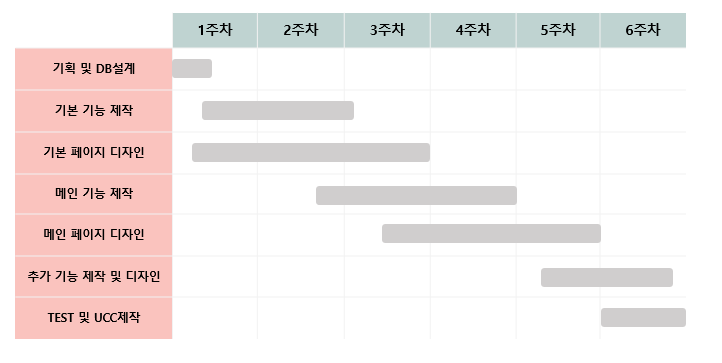

#### (5) 기술 스택

- Spring
- Vue.js
- mySQL
- 카카오오븐

**[System Architecture]**

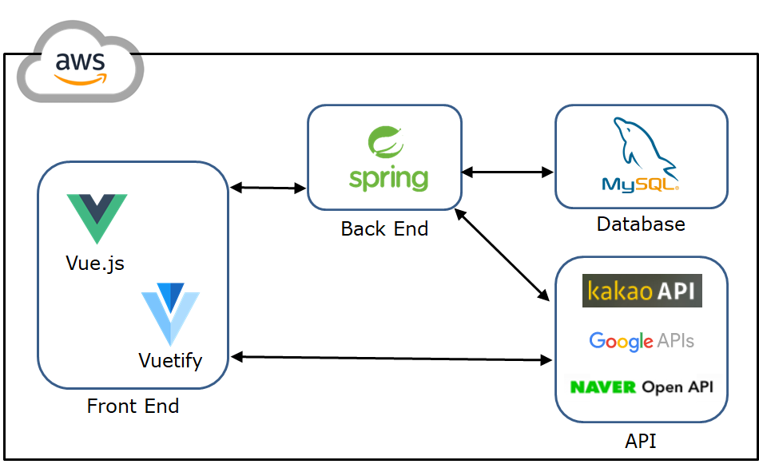


#### (6) 와이어프레임(화면구성)

- Main Gallery page

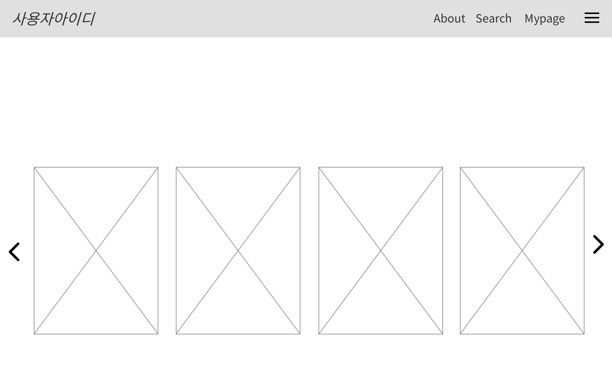

- Pinterest

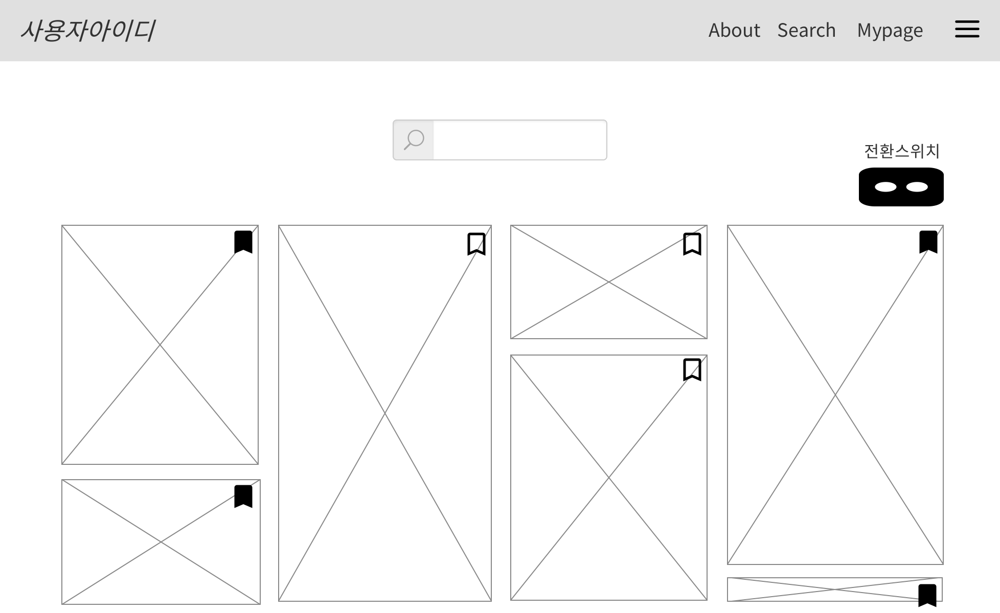

- Sub Gallery page

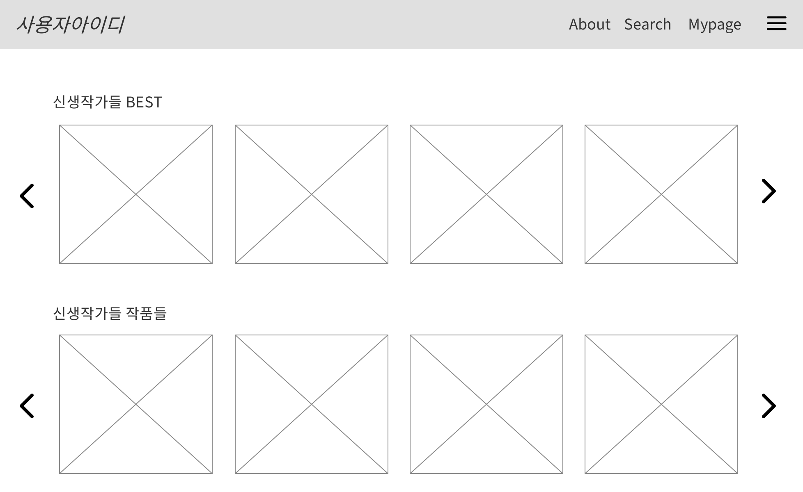

- My page

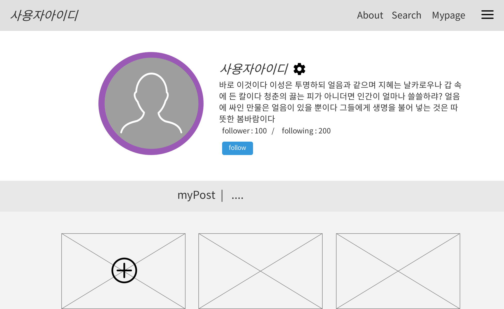

- Modify user data and my page

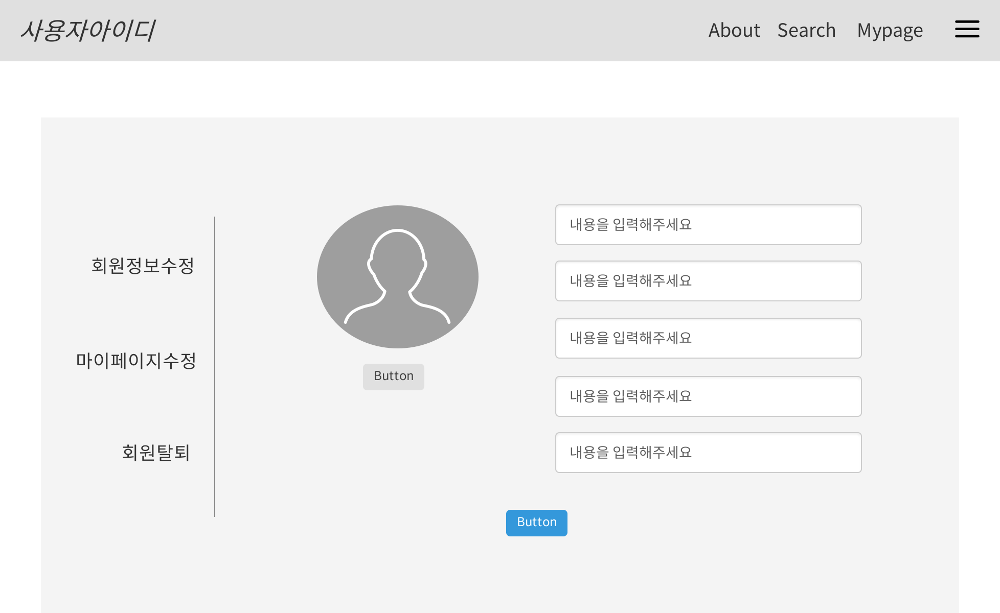

- About

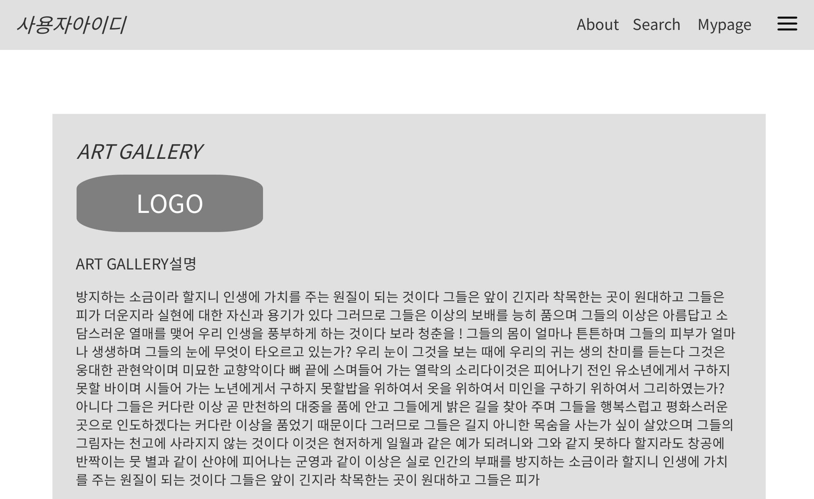

- Detail

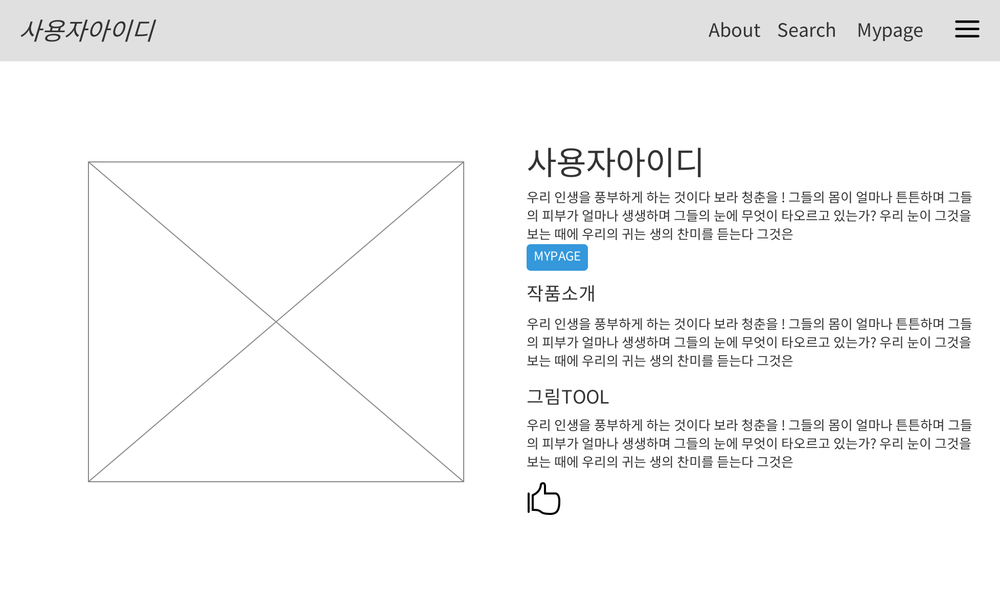

#### (7) Rest API

- ### 회원관리 [UserController]

  - 회원가입

    - ##### _join(user_id, user_name, user_nickName, user_password, user_email, user_tel, user_type)_

      - 나머지 DB 속성 값들은 NULL 값으로 저장
      - 닉네임 초기 회원가입시 Fix값 (랜덤)
      - 가입일 now()
      - UserDB(user_about) : default "나를 소개해보세요!" -> DB 기본 설정

  - 회원탈퇴

    - ##### _leaveUser(user_id)_

    - ##### _checkPassword(user_id, [input]input_password)_ => T/F or "such"

      - Params - input_password : 비밀번호 확인 시 사용자가 입력한 비밀번호
      - 사용자 입력 비밀번호와 DB에 저장된 비밀번호와 일치하는지 검사

  - 사용자 정보 받아오기

    - ##### _getUserInfo(user_id)_ => UserDto

      - 비밀번호를 제외한 모든 정보 return

  - 회원정보수정

    - ##### _modifyUser(user_id, user_name, user_nickName, user_password, user_email, user_tel, user_birth, user_profile)_

      - user_id -> query문 조건절 용

    - ##### _modifyUserAbout(user_id, user_about)_

      

- ### 로그인 관리 (JWT) [LoginController]

  - 로그인

    - ##### _login(user_id, user_password)_

  - 로그아웃

    - ##### ~~_logout_~~

  - 아이디 찾기

    - ##### _findId(user_name, user_email)_  => user_id

  - 비밀번호 찾기

    - ##### _findPassword(user_id, user_email, used_tel)_  

      - User DB에 등록된 이메일로 비밀번호 전송


- ### 작가 관리  [ArtistController]

  - 작가 정보받아오기

    - ##### _getArtistInfo(artist_id)_  => ArtistDto

  - 작가 등록하기

    - ##### _changeArtist(artist_id, artist_bank, artist_account, artist_name, artist_nickName, artist_exp)_

      - artist_id = user_id

  - 작가 등록 해제하기

    - ##### _leaveArtist(artist_id)_


- ### 작품 관리 [WorkController]

  - 작품등록

    - ##### _addWork(work_artistId, work_title, work_desc, work_piece, work_rating)_

      - work DB 에서 work_cost($:좋아요 수) 는 default값으로 0 지정해줌
      - work DB 에서 work_id auto_increment로 설정해놓음

  - 작품수정

    - ##### _modifyWork(work_id, work_title, work_desc, work_piece, work_rating)_

  - 작품삭제

    - ##### _deleteWork(work_id)_

  - 작품 전체 목록 조회

    - ##### _getAllWork()_

  - 팔로우한 작가 작품 목록 조회

    - ##### _getFollowingWork(follow_userId)_

  - 작품 검색 - 해시태그 검색

    - ##### _searchByHashTag([List]input_HashTag_List)_

      - Front 단에서 input string으로 받은 단어(해시태그)들을 리스트로 저장해서 매개변수로 호출

  - 작품 상세조회 (받아오기)

    - ##### _getWork(work_id)_

  - 작품 cost 부여 (좋아요 기능)

    - ##### _giveCostToWork(user_id, work_id)_

  - 작품 cost 부여 취소

    - ##### _clearToWorkCost(cost_userId, cost_workId)_

  - 작품 즐겨찾기

    - ##### _scrapWork(scrap_userId, scrap_workId)_

  - 작품 즐겨찾기 취소

    - ##### _clearToWorkScrap(scrap_userId, scrap_workId)_

  - 즐겨찾기 작품 목록

    - ##### _getAllScrapWork(scrap_userId)_

  - 내 작품 목록

    - ##### _getMyWorks(work_artistId)_


- ### 전시관 관리 [GalleryController]

  - 메인 갤러리에 "전시관" 추가 (Admin)

    - ##### _addGalleryToMainGallery(maingallery_id, maingallery_artistId)_

      - Main Gallery DB

  - 메인 갤러리 전시 전시관 목록 조회

    - ##### _getAllMainGallery()_

      - Main Gallery DB

  - 메인 갤러리 전시관 삭제 (Admin)

    - ##### _deleteGalleryToMainGallery(maingallery_id, maingallery_artistId)__

      - Main Gallery DB

  - 서브 갤러리에 "작품" 추가 (Admin)

    - ##### _addWorkToSubGallery(subGallery_artistId, subGallery_workId)_

  - 서브 갤러리 전시 목록 조회 

    - ##### _getAllSubGallery()_ 

  - 서브 갤러리 전시 작품 삭제 (Admin)

    - ##### _deleteWorkToSubGallery(subGallery_artistId, subGallery_workId)_

  - 개인 전시관 추가

    - ##### _addArtistGallery(gallery_id, gallery_name, gallery_desc, gallery_artistId, gallery_mainWorkId, [List]nput_workId)_

      - front단에서 전시관에 추가할 15개 이하 작품들을 선정한 후, 리스트로 묶어서 함수 매개변수로 호출

  - 개인 전시관 수정

    - ##### _addArtistGallery(gallery_id, gallery_name, gallery_desc, gallery_mainWorkId, [List]input_workId)_

  - 개인 전시관 삭제

    - ##### _deleteArtistGallery(gallery_id)_

  - 전시관 받아오기 (전시관 속 작품들 목록/상세정보)

    - ##### _getArtistGallery(galleryDesc_galleryId)_

  - 내 전시관 목록 받아오기

    - ##### _getMyGallery(gallery_artistId)_

  - 전시관 발자국 추가

    - ##### _giveFootPrintToGallery(footprint_galleryId, footprint_userId)_


- ### 관리자 관리  [AdminController]

  - 전체 사용자 조회

    - ##### _getAllUser()_

  - 작품 연령 등급 부여

    - ##### _giveRating(work_id)_

  - 작품 연령 등급 해제

    - ##### _clearRating(work_id)_

  - 추천 키워드(해시태그) 추가

    - ##### _addMainGalleryHashTag([List]input_string)_

      - keyword -> 

  - 추천 키워드(해시태그) 삭제

    - ##### _deleteMainGalleryHashTag()_

  - 추천 키워드(해시태그) 목록 조회

    - ##### _getMainGalleryHashTag()_

  - 전체 해시태그 목록 조회

    - ##### _getAllHashTag()_

  - 해시태그 삭제 

    - ##### _deleteHashTag(work_id, [input]input_string)_

      - 작품 해시태그만 삭제

    - ##### _deleteHashTag([input]input_string)_

      - 전체 작품들에서 해당 해시태그 모두 삭제

  - 메인관 작품 선정 (전시관)

    - ##### _renewMainGallery([List]input_string)_

      - 작품 추천 알고리즘

  - 서브관 작품 선정

    - ##### _renewSubGallery()_

      - -> 신규 유저 대상 작품 추천 알고리즘


- ### 메세지 관리 [MessageController]

  - 메세지 보내기

    - ##### _sendMessage(message_senderId, message_receiverId, message_title, message_content)_

      - message DB message_isCheck 컬럼 default 값 1(안읽음)

  - 메세지 목록

    - ##### _getAllMyMessage()_

  - 메세지 읽음 여부

    - ##### _checkMessage(message_id)_

      - message DB message_isCheck 컬럼 1 -> 0 (읽음)

  - 메세지 받아오기

    - ##### _getMyMessage(message_id)_

  - 메세지 삭제

    - ##### _deleteMessage(message_id)_


#### (8) DB스키마


#### (9) ERD

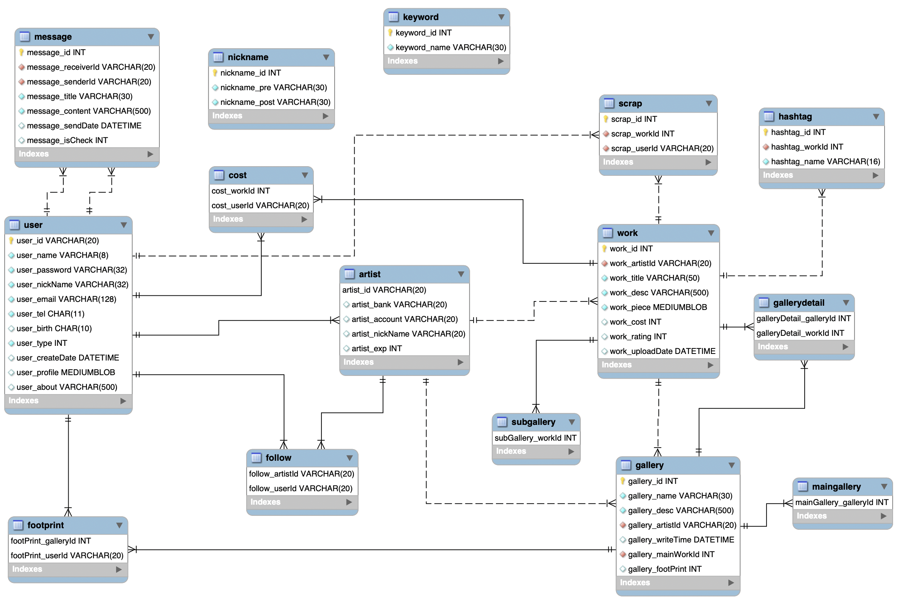

#### (10) Sequence Diagram

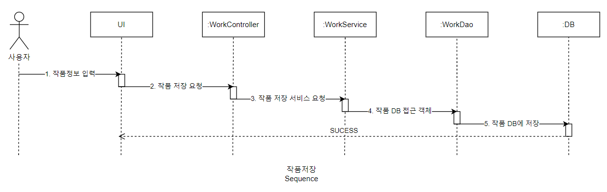

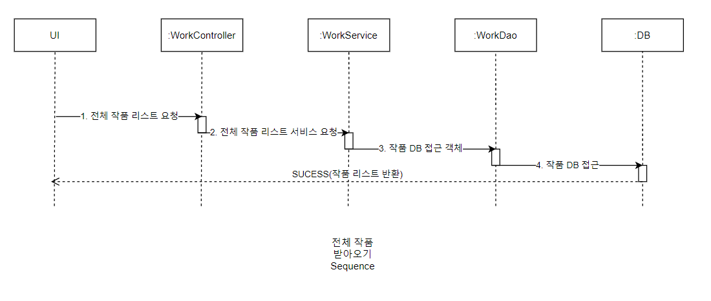

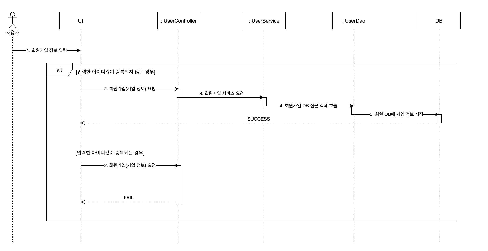

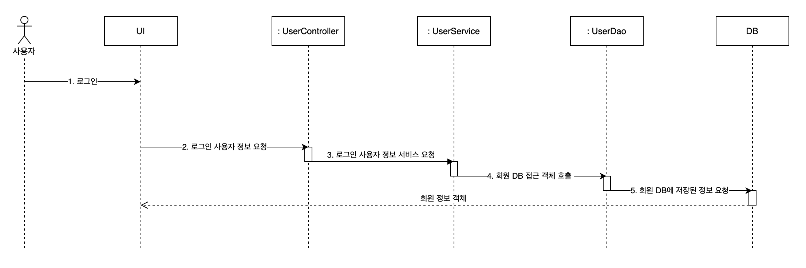

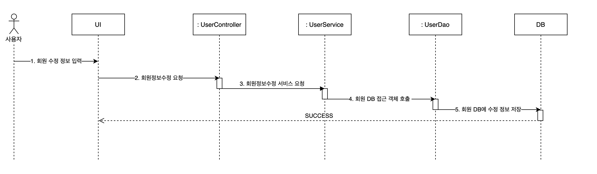


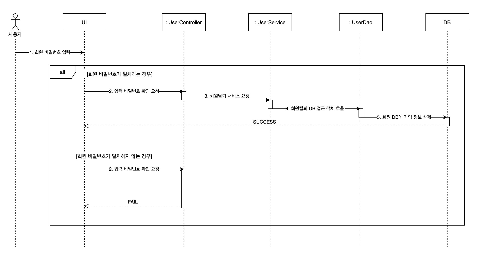


#### (10) 기능

- **기본 기능**
- **추가기능**

[2021/01/15 기준]

- [ ] 캡쳐방지 기능
- [ ] 다크 모드
- [ ] 이미지 크롭 기능 : 사진의 원하는 부분만 잘라서 프로필 사진으로 등록 ( 카카오톡 처럼 이미지 잘라서 프로필 등록) 자동으로 자르면 해상도를 많이 해친다.
- [ ] 반응형 웹 : 테블릿과 웹이 메인인 반응형 웹

[2021/01/19 기준]

- [ ] 큐레이트
- [ ] 배경음악 추가
- [ ] [보류] DM 기능
- [ ] [보류] 이미지 드래그 앤 드롭
- [ ] [보류] 소셜로그인


#### (11) 페이지 구성

[2021/01/19 수정]

1. Main page

   1. Main sub page : 명예의 전당
   2. 명예의 전당 디테일 페이지
   3. 로그인한 유저는 닉네임을 보여주고 게스트는 랜덤으로 닉네임을 생성하여 보여줘야 한다.
      1. 메인 이동 전 티켓에 랜덤이름을 부여하여 접속하도록 유도??? 아직 토의가 필요 


> 이하 로그인 필수 페이지  

2. 커뮤니티

   1. 커뮤니티 Main page : Pinterest
      1. 검색 바
      2. 팔로워들의 그림만을 볼 수 있는 버튼이 필요
   2. 커뮤니티 Detail page
      1. 버튼	
         1. 작가 페이지로 이동
         2. 즐겨찾기 버튼 위치 고민 : 핀터레스트에서 바로 보여 줄 것인가?
         3. 좋아요
         4. 해쉬 태그 표현
   3. 커뮤니티 작성 및 수정 폼 페이지
      1. 그림 제목
      2. 그림 설명
      3. 그림을 그린 툴에 대한 설명 :  설문에서 많이 나온 있으면 하는 기능.
      4. 해쉬 태그 작성
3. 19금관 페이지
   1. 구상이 더 필요 아직 아직아직직아직
4. 공지사항

   1. 공지사항 Main page
   2. 공지사항 작성 및 수정 폼 페이지
      1. 관리자만 접근 가능한 페이지
   3. 공지사항 Detail page
5. 마이페이지 -> 유저와 작가는 탭버튼만 다르게 나오게 구성

   1. 마이페이지 Main page
      1. 버튼
         1. Follow
         2. DM
         3. 폼 수정
         4. 알림 (추후 예정)
         5. 후원
         6. 햄버거 : 모든 페이지에서 필요 예상
         7. 탭 버튼 
            1. 전시관 : 시그니처가 필요하다/ 전시관에 올리고 싶은 그림만 올리고 싶은
               1. 태마별로 분류해 주어야 한다,
            2. 즐겨찾기한 그림을 보여주는 페이지로 이동하기 위한 버튼
            3. about : 작가의 정보를 보여주는 페이지로 이동하기 위한 버
         8. 배지 : pro, ama 등의 배지를 달 것인지
   2. 마이페이지 작성 및 수정 폼 페이지
      1. 프로필 사진 등록
      2. 자기소개
      3. 배경 사진 등록
      4. 본인이 사용하는 툴
6. 회원 관리

   1. 회원 가입
      1. 정보 ?
         1. 회원 가입때 모든 것을 받게 되면 페이지가 지저분해 진다.
         2. 회원 정보 수정 시 기입하는 것이 어떤지? 프로필 사진, 연락처, 생일
   2. 로그인
      1. 아이디 찾기
      2. 비밀번호 찾기
   3. 회원 정보 수정  -> 작가등록 여기서 가능
      1. 회원 탈퇴
      2. 비밀번호 변경
      3. 닉네임 변경
      4. 이메일 변경
      5. 휴대폰 번호 변경
   4. Contact to us
      1. 쪽지 및 이메일
7. 관리자
   1. 게시글 삭제 
8. 웹 페이지 설명(갤러리 about)
   1. 사이트 후원


### 5. Daily 회의 결과

[ 2021/01/18 ]

- 웹 기술 보다는 디자인에 치중되어 있는 느낌

  - 기술 추가를 위한 추가 기능 아이디어

    - 큐레이팅 서비스
    - 경매 시스템
    - 메인 작품 선정 -> 알고리즘
      - ex) 4월/봄/꽃 -> 좋아요수 - 회원가입 날짜 - 즐겨찾기 

- pinterest와 차별점이 없다.
  - pinterest가 유저를 위한 느낌이라면 우리는 작가를 위한 사이트
    - 해결 아이디어
      - 마이페이지에서 작가들의 그림 개인전 개최 (여기에 큐레이팅 접목)
        - 보완사항 : 개인전 수, 기간에 제한 두기 (무분별한 사용 막기 위해)    
- 추가 페이지 아이디어
  - 작가들만의 축제 페이지 
    - 하나의 주제를 던져주고 그림을 그려 경진대회를 개최
      - 신생 작가들을 위한 기회의 장 
- 팔로우한 작가들의 작품만 보고 싶은 경우에는?
  - 그림 LIST페이지에서 상단 바에 버튼 생성-> 전체그림보기/팔로우한 작가 그림보기

- 건의 사항

  - 좋아요를 ♥가 아닌 `$` 표시로 변경

- 토의 예정 사항

  - 작가 마이페이지와 게스트 마이페이지를 따로 할 것 인가?

    - 작가는 자신이 그린 그림과 전시회 페이지가 필요

    - 마이페이지를 작가만 주기에는 게스트의 즐겨찾기 그림은 어디에 보여주지??회원정보 수정은??

[2021/01/19]

- MainPage, MyPage 전면 수정
  - 그림이 아닌 전시회!
  - 감상평 삭제
- subGalleryPage 생성
  - 신생작가를 위한 공간
- 협업툴 규칙 설정 및 Zira 이슈 등록
- RestApi, DB전면 수정
- 와이어프레임 전면 수정
- [보류] 소셜로그인 기능
- 전시회 그림 드래그앤 드로그로 설정 [도전]
- DM 알림 표시 [도전] 

[2021/01/20] - 컨설턴트님 팀회의

- Git branch 이름말고 feature로 나누면 좋을 듯
- 이미지가 메인이니까 컴퓨터마다 보이는 색상이 다를 수 있으므로 주의하기
- 저작권에 대한 대처 방법을 넣어주거나 이렇게까지 해봤다 혹은 생각해봤다 이야기하면 좋을 듯 
- 아이디어는 굳!!!! 

[2021/01/21 ~ 2021/01/24]

-  구상된 아이디어를 바탕으로 기초 개발 기간


[2021/01/26]

- sub2 발표 대비 Minimun V Page 결정하기

  - 로그인, 회원가입, 작품올리기, 올라간 그림 보여주기 까지가 목표!

- 와이어프레임 다시 만들기 -> 컨설턴트님 팀회의

- 디테일 페이지 상세 내용 변경 

  - 부제 빼기, 그림 tool 따로 받기 

  

[2021/02/01]

```
[타이트하게 잡아놓은 현재 계획!]

- 2월 3일까지 -> 각자 맡은 페이지 디자인 및 기능 구현, vue연결
- 2월 4일 -> 자신이 만들어온 페이지 디자인 다같이 평가 및 수정
- 2월 5일 -> 평가 바탕으로 수정완료
- 2월 6일 ~ 2월 7일 -> 추가 기능 구현 및 전부 하나로 연결
- 2월 8일 ~ 2월 10일 -> 추가 작업 및 오류 수정 및 DB 제작 
- 2월 11일 ~ 2월 17일 -> 프론트: 권용수, 백앤드 : 오현정 , 영상제작: 강민지, 정수빈, 봉유정
- 2월 18일 -> 완료예정!
```

- 카카오로그인 => 문제 발생 ==> 7일 이후에 하기 
- **GIT 이름이 아닌 feature 단위로 만들기**
- post 글 textarea -> 에디터로 변경


[2021/02/04]

- 발표 
  - 시연 -> 전시관, 로그인, 회원가입, 19금관,회원정보 수정까지
  - 발표자 : 권용수
- 메인 페이지 디자인 결정
  - 글자보이고 밑 페이지에 전시관레이아웃
- 19금관 디자인 결정
- 작품 좋아요는 후원모양, 전시회 좋아요는 발자국
- 관리자 페이지는 ??????
- about페이지, 프로필 크롭기능 , 배지 구성 , 다크모드 
- 타이머 걸어서 몇시 이후에 자동으로 다크모드로 되는거 어떤가요?!
- 각자 해야할 일  (일요일 1시)
  - 권용수 : 전시회에 즐겨찾기, 발자국 , 후원한 그림 보기, 즐겨찾기한 전시관 보기
  - 정수빈 : 레드갤러리 레이아웃 디자인 & 함수 연결, 입장 애니메이션 적용 
  - 봉유정 : 서브갤러리 레이아웃 디자인 & 함수연결 
  - 오현정 : 서버연결!! 메인갤러리 레이아웃 디자인 & 함수연결
  - 강민지 : navbar만들기, 디테일페이지 카피라이터 추가, 작품개개인에는 즐겨찾기 필요 없음, 회원정보 수정 페이지, 어바웃페이지


### 6. 페이지 상황(server 기준)

#### (1) 2021/02/05


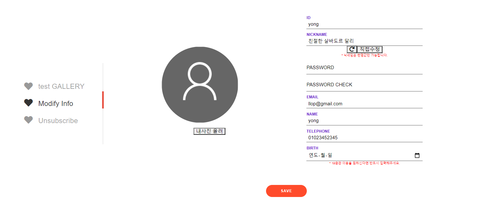

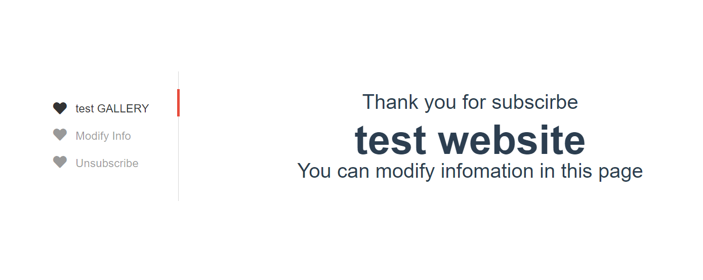

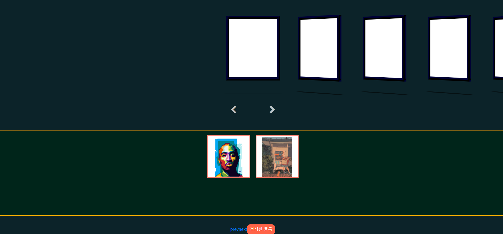

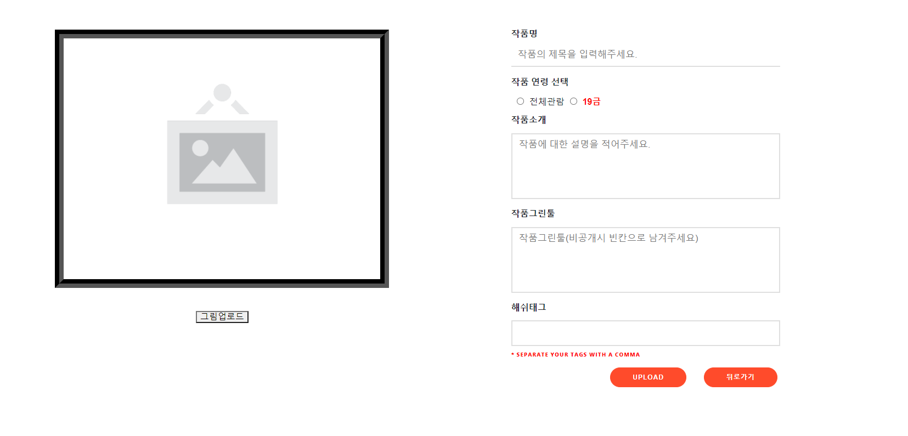

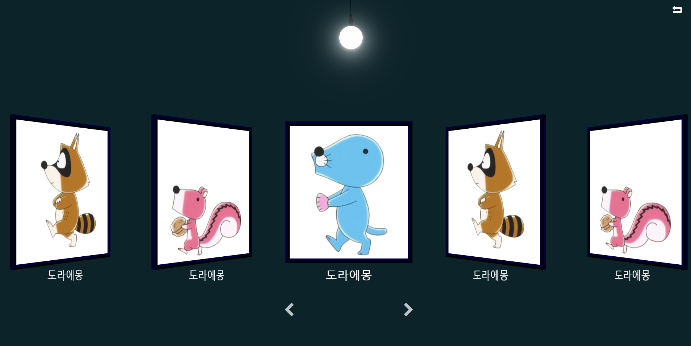

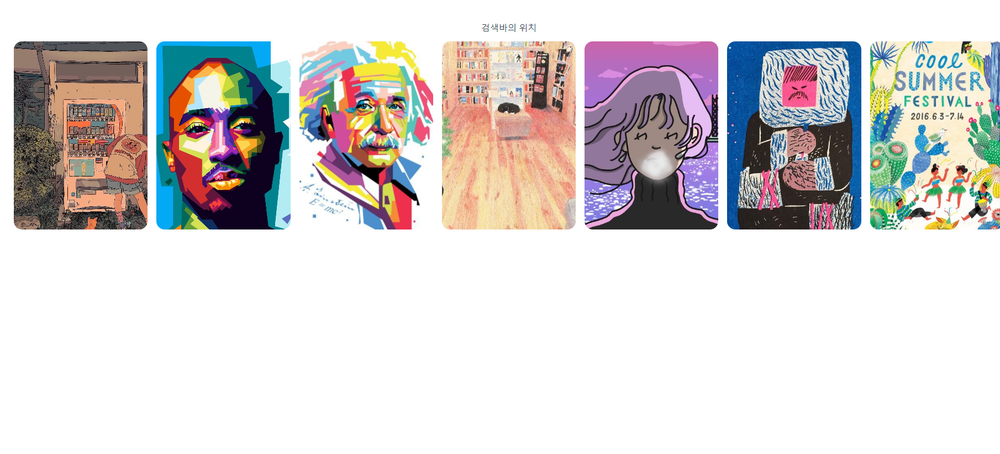

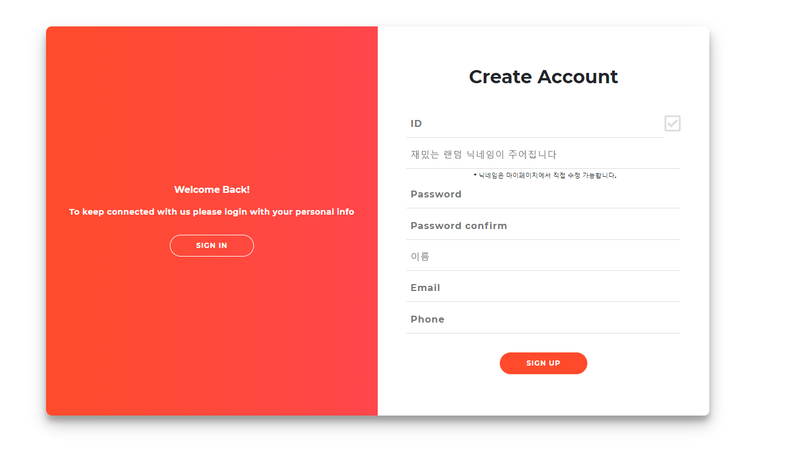

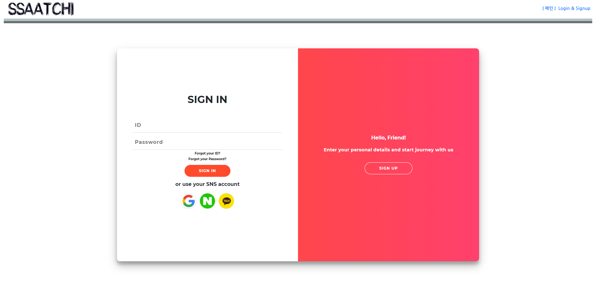