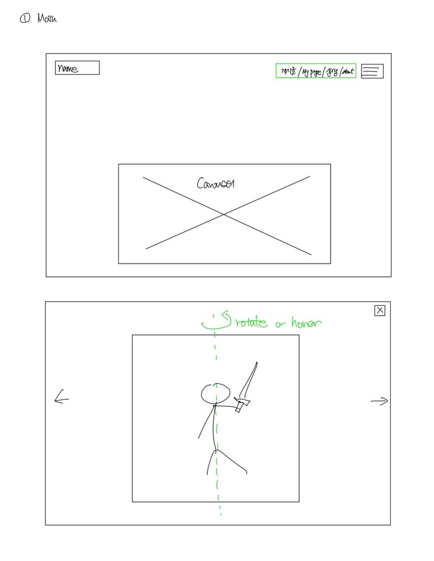
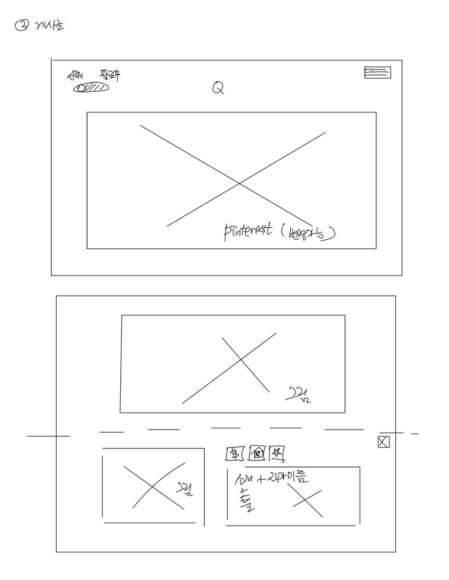
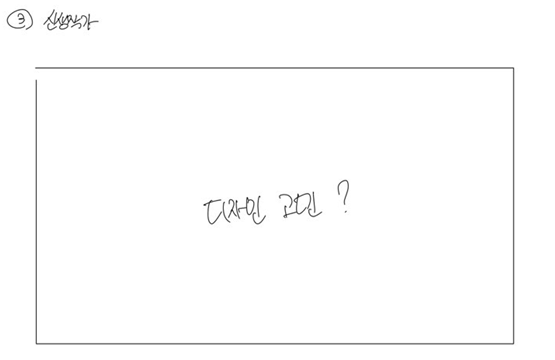
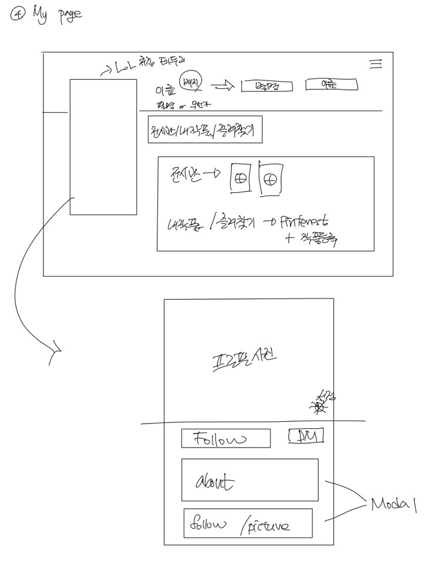
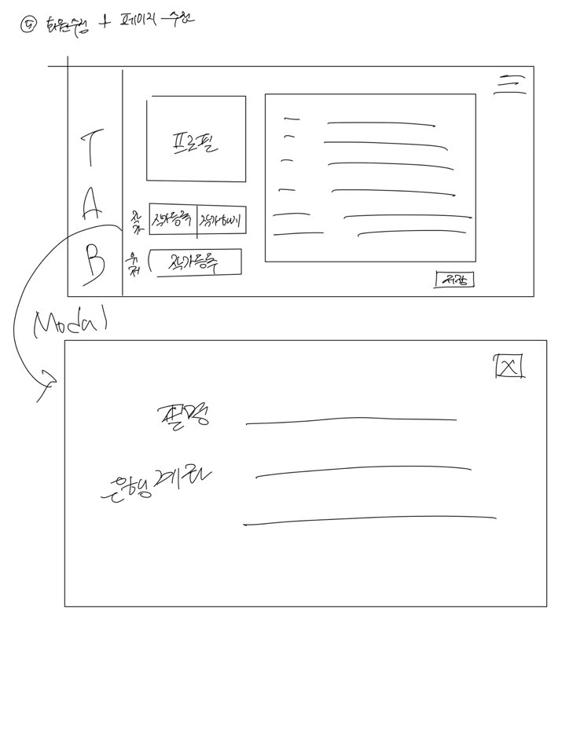
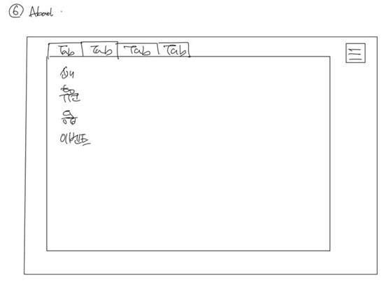
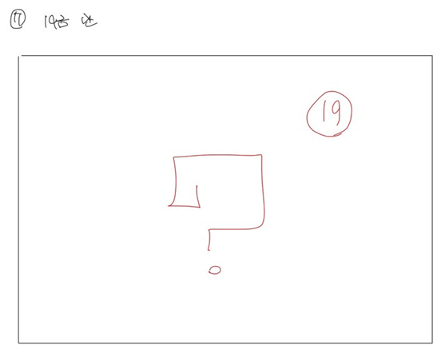

SSAFY 2학기 공통프로젝트

### #목차

1. 팀소개

2. 개발규칙

3. 협업툴 규칙

   1. Git
   2. Zira

4. 프로젝트 소개

   1. 주제

   2. 목적

   3. 기대하는 목표

   4. 진행 일정

   5. 기술 스택

   6. 와이어프레임

   7. Rest API

   8. DB스키마

   9. ERD

   10. 기능

   11. 페이지 구성

5. Daily 회의 결과

   

### 1. 팀소개

-  **팀명(B106)**
   - 이름 미정
-  **팀원소개**
   - 팀장 : 오현정(BE)
   - 팀원 : 강민지(FE), 권용수(FE), 정수빈(CTO), 봉유정(BE)
-  **역할**


### 2.개발규칙

- **공통**
  - 특수문자 _허용 안함!!!
- **클래스명**
  - 대문자로 시작
- **함수명**
  - 소문자의 동사로 시작
- **변수명**
  - 소문자로 시작하며 여러 단위로 이루어진 경우 각 단어의 첫글자를 대문자로 표기한다(카멜표기법)
- **그 외**
  - css는 html파일이 아닌 따로 폴더를 만들어서 관리


### 3. 협업툴 규칙

#### (1) Git

- **branch**

```
master -> develop -> [자신의 브랜치 ex-kmj, kys 등] 

1) clone
2) git checkout -b develop origin/develop
   : 중앙 저장소와 연결된 개발 브랜치를 만들기
3) git checkout -b [자신의 브랜치] develop 
   : 나의 격리된 branch 생성
```

- **merge request**

```
1) git push origin [자신의 브랜치]
2) GUI에서 create new merge request
3) kmj -> develop으로 요청 설정

RM컨벤션은
"이슈번호 / (Add/Update/Delete) 작업내용"
ex) s12345 /Add Login -> 이슈번호 없으면 None
```

- **commit**

```
항상 코딩하기전에 develop 가져오기
1) git checkout develop
2) git pull origin develop
3) git checkout [자신의 브랜치]
4) git pull origin [자신의 브랜치]
```

- **push**

```
push는 하루에 한 번 ! 자기 직전에 하기!
```


#### (2) Zira

EPIC

```
BACK, FRONT 나눠서 생성(ex: FRONT_LoginPage)
```

STORY

```
EPIC의 세부내용 작성 후 담당자설정 및 매주 Sprint에 올리기

#미리 Story 전부 생성시 매 주 월요일 담당자와 그 주에 해야할 일 결정 후 그 주sprint로 넘기기 & 기간 설정 & 포인트 배정(?)
```


### 4. 프로젝트 소개

#### 	[ Art Gallery (미정) ]	

> 이유 :

#### (1) 주제

#### (2) 목적

#### (3) 기대하는 목표 

- pinterest, behance와의 차별성 => 아티스트를 위한 GITHUB(전시관을 통해)

#### (4) 진행 일정

#### (5) 기술 스택

#### (6) 와이어프레임(화면구성)

- Main Gallery page



- Pinterest



- Sub Gallery page



- My page



- Modify user data and my page



- About



- 19 Gallery page




#### (7) Rest API

- 회원관리

  - 회원가입

  - 회원탈퇴

  - 사용자 정보

  - 비밀번호 체크

- 로그인 관리
    - 로그인
    - 로그아웃
    - 아이디 찾기
    - 비밀번호 찾기

- 마이페이지 관리
    - 회원정보수정
    - 작가 등록
    - 사용자 소개글 수정
    - 팔로워 수 받아오기
    - 팔로잉 수 받아오기
    - 작품 수 받아오기
    - 개인전시관 추가
    - 내 작품 목록
    - 즐겨찾기한 작품 목록
    - 팔로우하기

- 작품 관리
    - 작품 등록
    - 작품 수정
    - 작품 삭제
    - 작품 받아오기(상세)
    - 작품 전체 목록
    - 팔로우한 작가 작품 목록
    - 작품 cost 부여 (aka. like)
    - 전시관 cost 부여

- DM 관리
    - DM 보내기
    - DM 읽음 여부
    - DM 목록

- 관리자 관리
    - 전체 회원 조회
    - 회원 삭제
    - 작품 삭제

- 추가 기능
    - 작품/전시관 테마 추천 시스템 알고리즘
    - 큐레이팅 서비스

#### (8) DB스키마

#### (9) ERD

#### (10) 기능

- **기본 기능**
- **추가기능**

[2021/01/15 기준]

- [ ] 캡쳐방지 기능
- [ ] 다크 모드
- [ ] 이미지 크롭 기능 : 사진의 원하는 부분만 잘라서 프로필 사진으로 등록 ( 카카오톡 처럼 이미지 잘라서 프로필 등록) 자동으로 자르면 해상도를 많이 해친다.
- [ ] 반응형 웹 : 테블릿과 웹이 메인인 반응형 웹

[2021/01/19 기준]

- [ ] 큐레이트
- [ ] 배경음악 추가
- [ ] [보류] DM 기능
- [ ] [보류] 이미지 드래그 앤 드롭


#### (11) 페이지 구성

[2021/01/19 수정]

1. Main page

   1. Main sub page : 명예의 전당
   2. 명예의 전당 디테일 페이지
   3. 로그인한 유저는 닉네임을 보여주고 게스트는 랜덤으로 닉네임을 생성하여 보여줘야 한다.
      1. 메인 이동 전 티켓에 랜덤이름을 부여하여 접속하도록 유도??? 아직 토의가 필요 


> 이하 로그인 필수 페이지  

2. 커뮤니티

   1. 커뮤니티 Main page : Pinterest
      1. 검색 바
      2. 팔로워들의 그림만을 볼 수 있는 버튼이 필요
   2. 커뮤니티 Detail page
      1. 버튼	
         1. 작가 페이지로 이동
         2. 즐겨찾기 버튼 위치 고민 : 핀터레스트에서 바로 보여 줄 것인가?
         3. 좋아요
         4. 해쉬 태그 표현
   3. 커뮤니티 작성 및 수정 폼 페이지
      1. 그림 제목
      2. 그림 설명
      3. 그림을 그린 툴에 대한 설명 :  설문에서 많이 나온 있으면 하는 기능.
      4. 해쉬 태그 작성
3. 19금관 페이지
   1. 구상이 더 필요 아직 아직아직직아직
4. 공지사항

   1. 공지사항 Main page
   2. 공지사항 작성 및 수정 폼 페이지
      1. 관리자만 접근 가능한 페이지
   3. 공지사항 Detail page
5. 마이페이지 -> 유저와 작가는 탭버튼만 다르게 나오게 구성

   1. 마이페이지 Main page
      1. 버튼
         1. Follow
         2. DM
         3. 폼 수정
         4. 알림 (추후 예정)
         5. 후원
         6. 햄버거 : 모든 페이지에서 필요 예상
         7. 탭 버튼 
            1. 전시관 : 시그니처가 필요하다/ 전시관에 올리고 싶은 그림만 올리고 싶은
               1. 태마별로 분류해 주어야 한다,
            2. 즐겨찾기한 그림을 보여주는 페이지로 이동하기 위한 버튼
            3. about : 작가의 정보를 보여주는 페이지로 이동하기 위한 버
         8. 배지 : pro, ama 등의 배지를 달 것인지
   2. 마이페이지 작성 및 수정 폼 페이지
      1. 프로필 사진 등록
      2. 자기소개
      3. 배경 사진 등록
      4. 본인이 사용하는 툴
6. 회원 관리

   1. 회원 가입
      1. 정보 ?
         1. 회원 가입때 모든 것을 받게 되면 페이지가 지저분해 진다.
         2. 회원 정보 수정 시 기입하는 것이 어떤지? 프로필 사진, 연락처, 생일
   2. 로그인
      1. 아이디 찾기
      2. 비밀번호 찾기
   3. 회원 정보 수정  -> 작가등록 여기서 가능
      1. 회원 탈퇴
      2. 비밀번호 변경
      3. 닉네임 변경
      4. 이메일 변경
      5. 휴대폰 번호 변경
   4. Contact to us
      1. 쪽지 및 이메일
7. 관리자
   1. 게시글 삭제 
8. 웹 페이지 설명(갤러리 about)
   1. 사이트 후원


### 5. Daily 회의 결과

[ 2021/01/18 ]

- 웹 기술 보다는 디자인에 치중되어 있는 느낌

  - 기술 추가를 위한 추가 기능 아이디어

    - 큐레이팅 서비스
    - 경매 시스템
    - 메인 작품 선정 -> 알고리즘
      - ex) 4월/봄/꽃 -> 좋아요수 - 회원가입 날짜 - 즐겨찾기 

- pinterest와 차별점이 없다.
  - pinterest가 유저를 위한 느낌이라면 우리는 작가를 위한 사이트
    - 해결 아이디어
      - 마이페이지에서 작가들의 그림 개인전 개최 (여기에 큐레이팅 접목)
        - 보완사항 : 개인전 수, 기간에 제한 두기 (무분별한 사용 막기 위해)    
- 추가 페이지 아이디어
  - 작가들만의 축제 페이지 
    - 하나의 주제를 던져주고 그림을 그려 경진대회를 개최
      - 신생 작가들을 위한 기회의 장 
- 팔로우한 작가들의 작품만 보고 싶은 경우에는?
  - 그림 LIST페이지에서 상단 바에 버튼 생성-> 전체그림보기/팔로우한 작가 그림보기

- 건의 사항

  - 좋아요를 ♥가 아닌 `$` 표시로 변경

- 토의 예정 사항

  - 작가 마이페이지와 게스트 마이페이지를 따로 할 것 인가?

    - 작가는 자신이 그린 그림과 전시회 페이지가 필요

    - 마이페이지를 작가만 주기에는 게스트의 즐겨찾기 그림은 어디에 보여주지??회원정보 수정은??

[2021/01/19]

- MainPage, MyPage 전면 수정
  - 그림이 아닌 전시회!
  - 감상평 삭제
- subGalleryPage 생성
  - 신생작가를 위한 공간
- 협업툴 규칙 설정 및 Zira 이슈 등록
- RestApi, DB전면 수정
- 와이어프레임 전면 수정